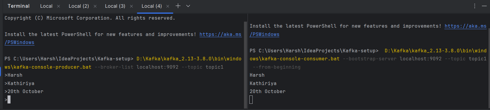

## 1. Start Zookeeper

### For Windows:
`D:\Kafka\kafka_2.13-3.8.0\bin\windows\zookeeper-server-start.bat  D:\Kafka\kafka_2.13-3.8.0\config\zookeeper.properties`

* ###### (breakdown: First we gave the path to script file and then we provided the properties file path)

* ###### Default port for Zookeeper is 2181

## 2. Start Kafka Server

`D:\Kafka\kafka_2.13-3.8.0\bin\windows\kafka-server-start.bat D:\Kafka\kafka_2.13-3.8.0\config\server.properties`

* ###### Default port for Kafka Broker/Server is 9092

## 3. Create a Topic

`D:\Kafka\kafka_2.13-3.8.0\bin\windows\kafka-topics.bat --bootstrap-server localhost:9092 --create --topic topic1 --partitions 3 --replication-factor 1`

### To Get the List of Topics

`D:\Kafka\kafka_2.13-3.8.0\bin\windows\kafka-topics.bat --bootstrap-server localhost:9092 --list`

### To Describe the Topic

`D:\Kafka\kafka_2.13-3.8.0\bin\windows\kafka-topics.bat --bootstrap-server localhost:9092 --describe --topic topic1`

## 4. Open Offset Explorer 3.0 for Better Visualization of data being produced and consumed
* It will ask for bootstrap server host and Zookeeper port to establish the connection.

## 5. Start Producing the data to Kafka

`D:\Kafka\kafka_2.13-3.8.0\bin\windows\kafka-console-producer.bat --broker-list localhost:9092 --topic topic1 `

## 6. Start Consuming the data from Kafka

`D:\Kafka\kafka_2.13-3.8.0\bin\windows\kafka-console-consumer.bat --bootstrap-server localhost:9092 --topic topic1 --from-beginning`

# Setup Zookeeper and Kafka using Docker Compose file

* find the docker-compose.yml file, it contains the configuration for zookeeper and Kafka both.
* docker file can be run directly using UI
* to run using CLI: `docker compose -f docker-compose.yml up -d`
* ###### (Make sure to start docker desktop before running the yml file)

